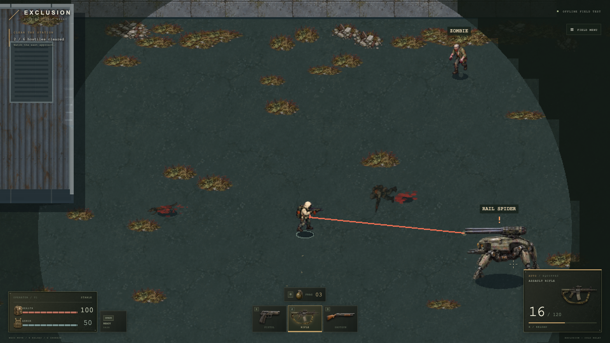

# Multiplayer Shooter

A browser PvPvE shooter prototype built with Phaser and TypeScript. The long-term direction is 16+ players entering a ruined map with a cheap gun, searching for loot, and choosing whether to fight, avoid, or cooperate.



## Play the local prototype

```sh
npm ci
npm run dev
```

Open the local address printed by Vite, select a starting weapon, then choose **Enter the zone**. Desktop keyboard and mouse are required. The current working title is **Exclusion**.

| Control | Action |
| --- | --- |
| WASD / arrow keys | Move |
| Mouse / left button | Aim with crosshair / fire |
| 1 / 2 / 3 / 4 | Pistol / assault rifle / shotgun / railgun |
| Weapon icons | Click to switch guns |
| R | Reload |
| G | Throw grenade toward cursor |
| E | Open or close a nearby door |
| Space | Dash, when enabled |
| Field Menu | Music volume, dash, collision display, fullscreen, restart |

## Implemented

- Two enterable buildings, doors, windows, stationary cars and collision.
- Occluded line of sight, dim explored terrain and fading roofs. Hidden enemies are not rendered.
- Pistol, rapid-fire AR and six-pellet shotgun; separate magazine/reserve ammo for each gun. All four are supplied for this combat test, before introducing looting.
- Railgun in slot 4: two powerful shots per run, zero reserve, slow firing cadence and a cyan rail discharge. Reloading or switching does not restore ammo.
- 100 health and 50 armor. Armor absorbs damage first; overflow reduces health. Neither regenerates in this slice.
- Six hostiles: a pistol robot, an AR scavenger, a shotgun scavenger, a fast rabid dog, a slower zombie and a large armored rail spider.
- Enemy sight/noise response, ranged attack warning, melee cooldowns, damage, death and local restart.
- Cold Relay artwork: generated directional character sprites, textured buildings and street, wrecked cars, muzzle flashes, casings, smoke, sparks and impact debris. Recorded firearm reports, handling and creature sounds, stereo enemy fire, crosshair and a styled health/armor/ammo HUD.
- Full armed poses and four-frame walking cycles for every actor, including each player weapon.
- Three throwable grenades per run, visible arc/fuse, blast falloff, cover protection and self-damage.
- Directional blood spray and ground stains on flesh hits, with distinct flesh and metal impact sounds. Armor and robots produce metal feedback.
- Quiet original ambient music loop with a saved volume/mute control in the Field Menu; fades out when the game loses focus.
- Gritty survival interface: textured dark metal, muted amber, compact health/armor bars, ammunition and reload display, weapon slots, grenade count, and redesigned entry, field and death menus.

- Rail spider in the far southeast: 1.2-second railgun charge with a brief aim lock, and six-shot machine-gun bursts up close. Dodge after the red lock or break line of sight.
- Dog bite wind-up and lunge, distinct enemy death voices, animated collapses and persistent corpses.
- Realistic equipment artwork in the loadout and selected-gun display; shared barrel anchors for projectiles.

The map opens to the east. The AR scavenger patrols the northeast; the dog, zombie and shotgun scavenger occupy the southeast. Keep moving, watch sightlines, and use cover while reloading.

## Current limits

This is a **local combat test**. Online play, 16-player capacity, inventory, loot loss, extraction, healing, armor replacement and persistence are not implemented. Restart resets this test; it is not the eventual respawn/loot-loss experiment. Enemy movement uses direct steering, not navigation around complex obstacles. Balance and artwork are provisional; directional walking cycles are implemented, with bespoke reload/throw/death sprite atlases still to come. Deaths currently use animated falls and crumples of the last living pose.

## Verification

```sh
npm test
npm run build
npx playwright install chromium
# Keep npm run dev running for browser checks:
node tests/browser/verify.mjs
node tests/browser/arsenal.mjs
node tests/browser/cold-relay.mjs
node tests/browser/weapon-presentation.mjs
node tests/browser/grenades.mjs
node tests/browser/walking.mjs
node tests/browser/survival-ui.mjs
node tests/browser/dog-bite.mjs
node tests/browser/spider.mjs
node tests/browser/player-railgun.mjs
node tests/browser/music.mjs
```

The build includes type checking. Browser scripts exercise actual controls and save screenshots/state under ignored `output/` folders. `?test=1` enables deterministic stepping and visible-state inspection; normal play omits those hooks.

- [Player railgun](docs/art/player-railgun.md)
- [Spider and field feedback](docs/art/spider-and-field-feedback.md)
- [Audio sources and licenses](public/audio/field/CREDITS.md)
- [Combat presentation, sounds, grenades and walking assets](docs/art/combat-presentation.md)
- [Survival interface and hit feedback](docs/art/survival-ui-and-hit-feedback.md)
- [Cold Relay art, assets and implementation notes](docs/art/cold-relay.md)
- [Verification notes](docs/playtests/first-slice-verification.md)
- [Game design and milestones](docs/superpowers/specs/2026-09-10-browser-pvpve-prototype-design.md)
- [First playable implementation plan](docs/superpowers/plans/2026-09-10-first-playable-slice.md)

Networking is the next major milestone: an authoritative TypeScript server, client movement prediction and measured 16-player playtests before expanding the world.
