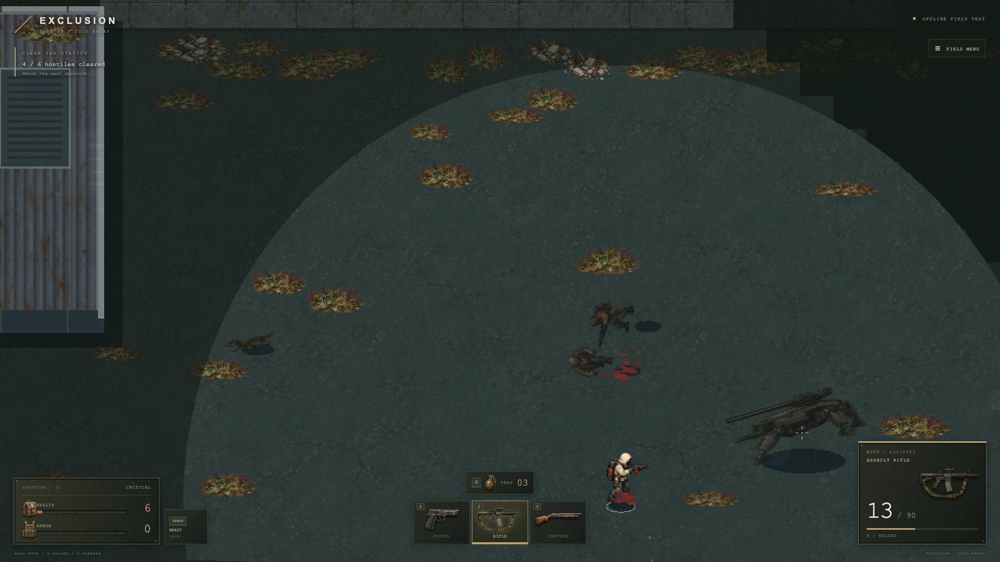
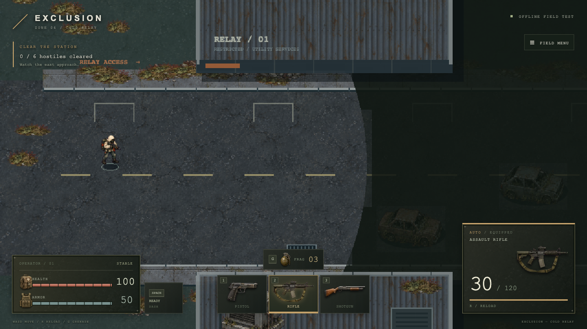

# Spider and field feedback — 2026-09-10

The user's requested large walking robot spider is a sixth enemy in the southeast yard. It has 320 health, 60 armor, a 28-unit collision radius and an 86-pixel sprite height (human characters are 48 pixels). It patrols at 65 units/sec.

At 210–390 units it charges for 1.2 seconds, tracks the player until the final .35 seconds, then fires at the locked point. Amber aiming lines become red on lock. The rising synthesized charge runs for 1.16 seconds, followed by one of two deep rail-discharge variants with a longer pressure tail than the player weapon. The rail shot deals 65 damage and respects solid cover. Breaking line of sight cancels charging. Within 210 units it fires six-round machine-gun bursts: 8 damage, .12 seconds apart, followed by .8 seconds recovery. The prototype represents the twin rail assembly with one damage ray per discharge.

## Generated art

Original generated PNGs are retained unchanged. Phaser imports and scales atlas frames at startup. No reference-game artwork is shipped.

- `public/art/cold-relay/walk/spider.png`: built-in image generation, output `exec-f21e82a1-4306-4a63-94c8-9fdd4374d3ee.png`. Brief: original worn olive industrial six-legged robot spider, twin long railguns and short close-range machine guns, 4-column/5-row transparent sprite atlas, four walk phases per south/southeast/east/northeast/north facing, consistent scale and pixel-art game readability. Four movement-driven frames plus mirrored bearings.
- `public/art/cold-relay/equipment-key.png`: built-in image generation, output `exec-f190e998-daf8-455f-a752-1a019a200d92.png`. Brief: original realistic worn equipment atlas, three columns/two rows: pistol, assault rifle, pump shotgun; medical pouch, armored vest, grenade. Isolated on flat magenta, readable steel/canvas details, no text or labels. Runtime keying creates HUD item images. The HUD shows the equipped gun and distinct loadout items.

## Related requested fixes

- Dog bites have a .16-second wind-up, lunge/snap, contact/range/cover validation and recovery.
- Shared muzzle anchors place shots and projectiles at the displayed barrel. Cursor rays originate there; nearby cover is swept before spawning a projectile.
- Deaths retain the last living pose and fall/crumple over .48 seconds. Human bodies fall sideways; dogs crumple and metal enemies collapse. Corpses remain, with bounded hit/death particles and stains.
- Recorded reports, handling, footsteps, impacts and death voices replace default synthesized cues once decoded. See `public/audio/field/CREDITS.md` and per-file provenance.

These remain prototype pose transformations, not bespoke hand-animated death atlases. Inventory was discussed but is not implemented; the existing start screen accurately says no looting. Online play and persistence remain separate future work.

## Verified presentation

66 unit tests and the production build passed. Browser checks covered rail lock/dodge, close combat, spider walk and collapse, real audio decoding/playback, all original enemies, dog bites, weapon switching/reload, doors, grenades, restart and responsive HUD layouts. The standard input runner passed after increasing only its initial click timeout for artwork loading. No page errors in the completed browser suites.

