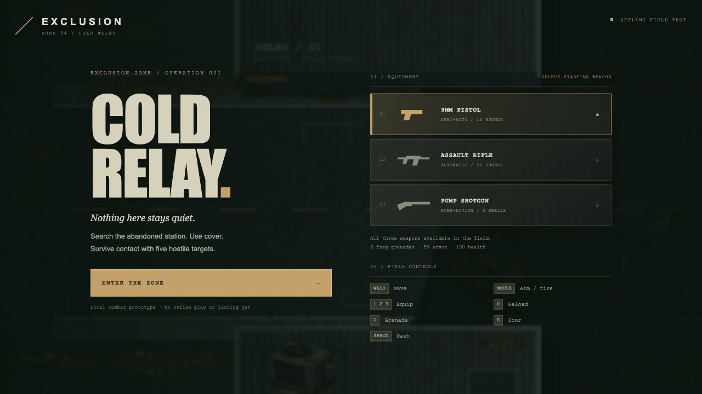
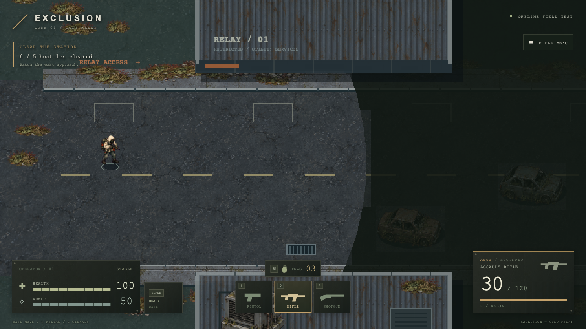
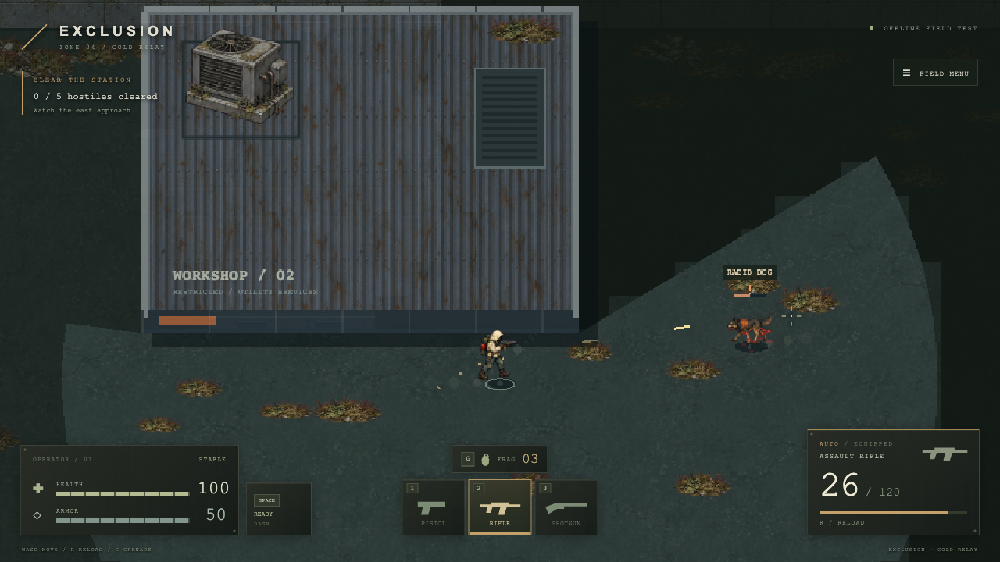

# Survival interface and hit feedback — 2026-09-10

The user selected **Gritty survival — worn metal, compact bars, muted amber** for the full interface redesign.

## Interface

Dark olive metal panels reuse the existing Cold Relay surface texture, with bone text, muted amber selection states and subtle panel edges. No new raster assets were generated for this pass.

- Bottom-left condition panel groups segmented health and armor bars with numeric values and stable/wounded/critical status.
- Bottom-right weapon panel shows the equipped silhouette, fire mode, magazine and reserve ammunition, reload progress and empty/low-ammo states.
- Centered clickable weapon slots retain 1/2/3 controls; the grenade counter retains G. Layout reflows at narrow widths.
- Entry screen offers a functional starting-weapon choice; all three weapons are still supplied for the combat prototype.
- Field menu groups simulation options and resume/restart. Death screen reports hostiles cleared and redeploys with fresh supplies.

## Hit feedback

Flesh impacts produce short directional red droplets and small ground stains; organic deaths produce a larger burst. Robots and armor keep metal sparks. Projectile and grenade impacts identify their actual target. Visibility gating and existing particle/stain caps remain in place; restart clears effects.

Original synthesized impact sounds use a short flesh thud or metallic ring, four cached variations, distance attenuation and stereo positioning. Hits on the same target within 60 ms are coalesced so shotgun pellets do not stack six identical sounds. Wall impacts and player hits do not trigger the new enemy-hit cue. Existing gun and explosion sounds remain.

## Verification

- 51 unit tests, TypeScript validation and production build passed.
- Arsenal browser suite encountered and defeated all five enemies; captured blood on a living organic target and observed both impact sample types scheduled by browser audio. No page errors.
- Survival UI suite checked starting weapons, field settings/resume, clickable gun selection and non-overlapping panels at desktop, 900×1000, 600×700 and 430×700 sizes.
- Baseline browser suite passed door, combat, reload, death/restart and pause checks. Weapon presentation suite passed audio, switch/reload and layout checks.
- Standard web-game runner completed. Entry, HUD, settings, death, narrow layout and organic-hit screenshots were visually inspected.

The browser checks verify audio playback scheduling; subjective sound quality remains a listening judgment. This remains a local desktop keyboard/mouse prototype; narrow layout checks do not add touch controls or establish multiplayer capacity. The existing large-bundle build warning remains.
