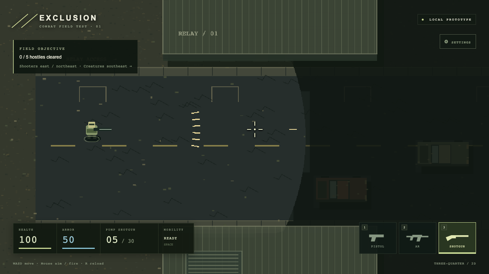
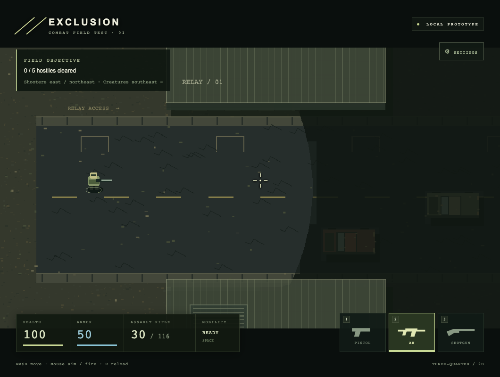

# Local combat slice verification

Date: 2026-09-10. This is a local browser prototype, not a multiplayer capacity result.

## Scope

Movement, doors, collision and visibility; three guns and their ammunition; crosshair and armor; three armed hostiles, one rabid dog and one zombie; local death/restart. The original one-robot milestone was expanded by the user's subsequent request.

## Automated and visual checks

- 37 unit tests passed. Includes normalized movement, swept projectile collision, wall/door occlusion, fixed-step input edges, weapon cadence/spread/reload, ammo preservation, armor overflow, melee walls/cooldowns/death, shotgun engagement distance and vertical engagement limits.
- Type checking and production build passed. Vite reports the Phaser-containing bundle exceeds its default 500 kB warning threshold: approximately 1.41 MB minified / 370 kB gzip. This warning remains.
- `tests/browser/verify.mjs`: start, door entry/open/close, occupied-door rejection, closed-door shooting, reload, settings, aspect-ratio changes, pistol combat, enemy/player death, restart and focus pause/resume passed in Chromium 153.0.8010.12.
- `tests/browser/arsenal.mjs`: crosshair, keyboard/click weapon switching, ammo persistence, AR/shotgun fire, reload, HUD bounds after resize, and normal-movement encounters with all five enemies. Each enemy was defeated across the test routes, without modifying simulation state.
- Standard develop-web-game Playwright runner also exercised movement and combat. Its canvas screenshots were inspected alongside the supplemental full-page screenshots, which include the HTML HUD.
- No application errors were recorded in the browser runs. Chromium screenshot capture produced four `GPU stall due to ReadPixels` warnings in the main integration suite; these are recorded separately.
- The live in-app browser entry/gameplay and fullscreen were inspected. Other browser engines, touch controls and physical speaker output have not been verified.

## Defects corrected during testing

- Phaser 4 WebGL visibility uses external filter masks; legacy geometry masks do not provide the required WebGL result.
- Aim coordinates account for the drawn character's body being above its ground collision point.
- Cars remain visually readable when their near side is visible.
- Enemy engagement is constrained vertically to keep initial threats within the fixed gameplay view. This is provisional tuning, not the eventual network visibility rule.
- Canvas centering margins could move the entire HUD below the window at a tall aspect ratio. The game surface is now absolutely positioned, with regression checks for both bottom panels.

## Performance evidence and limits

An earlier 60-second measurement of the original one-enemy scene on an Apple M2 Max used headless Chromium's **SwiftShader software renderer**, at a 1920×1080 viewport with a 960×540 logical canvas. It recorded 25.7 mean animation frames/second, 33.3 ms median frame interval and 83.3 ms p95. That result does not demonstrate 60 fps, hardware GPU performance, current expanded-roster performance or online capacity. The reproducible script is `tests/browser/performance.mjs`; its original raw report remains under the ignored local output directory.

## Remaining boundaries

No networking, inventory, loot, extraction, healing, armor replacement or persistence. AI uses direct steering and can stop at complex obstacles. Art, effects and balance are placeholders. Starting with three guns is a combat-test convenience; the planned scavenging loop still starts with a cheap gun. Real 16-player tests require the next server/client milestone.

Screenshots and structured reports are saved locally under `output/browser-verification/`, `output/arsenal-verification/` and the standard runner's output folders. Representative images are retained below.

